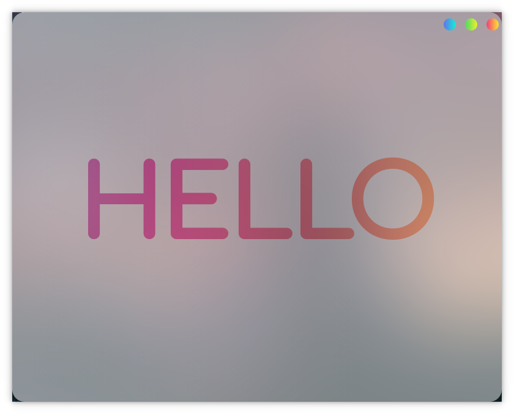

# qt-html-transparency-example
An example of a window built in qt and html/css that can let you see-thru your desktop.

## Build

To compile it type in the terminal `mkdir build && cd build` then `qmake ../window-content.pro -spec linux-g++`, if you are using a Linux OS, and then type `make`. \
If you have any problems when attempting to compile it. Try using `make qmake_all`. The process that the IDE does is `make -j4 in .` and for cleaning `make clean -j4 in .`, it may help you. Also the IDE uses the complete path to the files. If you still have any issues, try using the **Qt Creator** IDE.

## Details

I only tested it in Kde Manjaro, however it may works in other environments or systems. To make it blur use the compositor of your system. You can use it to make beautiful applications, you just need to change the HTML and CSS file, and then reload. Don't forget of setting the main background color to have some value of transparency. The window doesn't resize yet. Unless you remove the frameless option, it make the built-in buttons unuseful. The roundness in the corners is also brought by the compositor, but it might be possible to make the window round with qt. 

## How it works

The secret is the 'setAttribute(Qt::WA_TranslucentBackground);' then the 'setAutoFillBackground(true)' and the 'setStyleSheet("background: transparent;");' lines in the *mainwindow.cpp* file. Also set the color of window class to "transparent" and import the 1.2 version of **QtWebEngine** and set the BackgroundColor of the webengineview class to "transparent" in the *main.qml* file. And then set the background color of the *style.css* file to use alpha channel (transparency).
